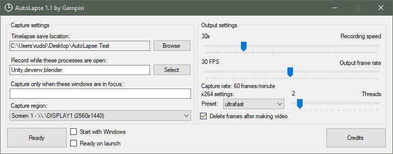

#AutoLapse

Simple set-up-and-forget utility for recording timelapses of computer screens.

With AutoLapse you can automatically start recording a timelapse of your work (programming, art, game development), which is automatically sped up to a desired speed. You can set the utility to activate on startup, so you always have timelapses ready in case you need them.

Things that might cause issues and are not tested:  
 * Multiple monitors
 * 4K screen resolution (1440p works on my machine)
 * Exclusive fullscreen games
 * How long footage can you really record with it?
 
Known issues:  
 * Because of how AutoLapse generates video (takes a sequence of screenshots and stitches them at the end), too quick framerate may cause issues keeping up and the final video might have fluctuating speed.
 * When AutoLapse is quit while recording is in progress, a notification that notifies of video completion does not appear, however the video is completed
 * There is no toggle to disable notifications from AutoLapse, however I've tried to make them informative, not intrusive.
 
AutoLapse uses FFmpeg to convert images to a video.  
AutoLapse uses the FFmpeg project (ffmpeg.exe) under the GPLv2 (libx264).  
FFmpeg is a trademark of Fabrice Bellard, originator of the FFmpeg project.

AutoLapse is licenced under the GPLv2.